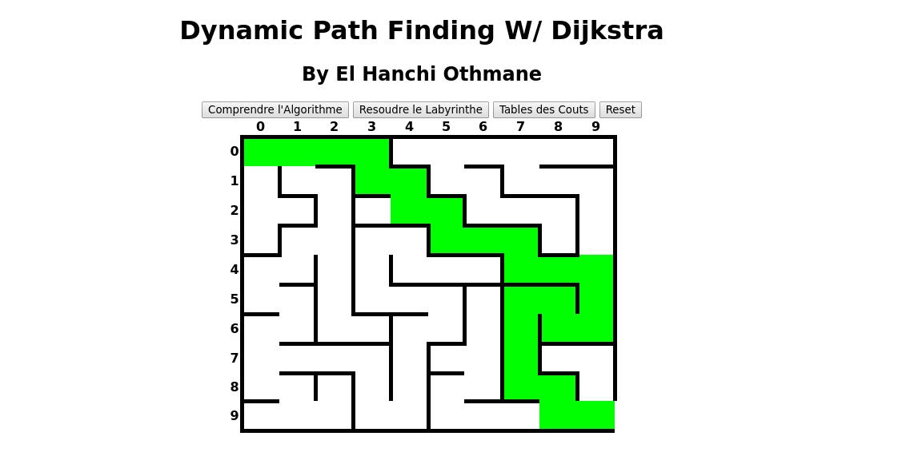
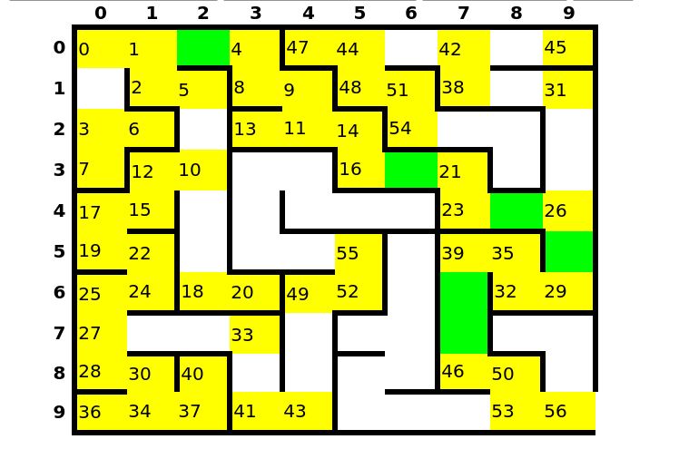
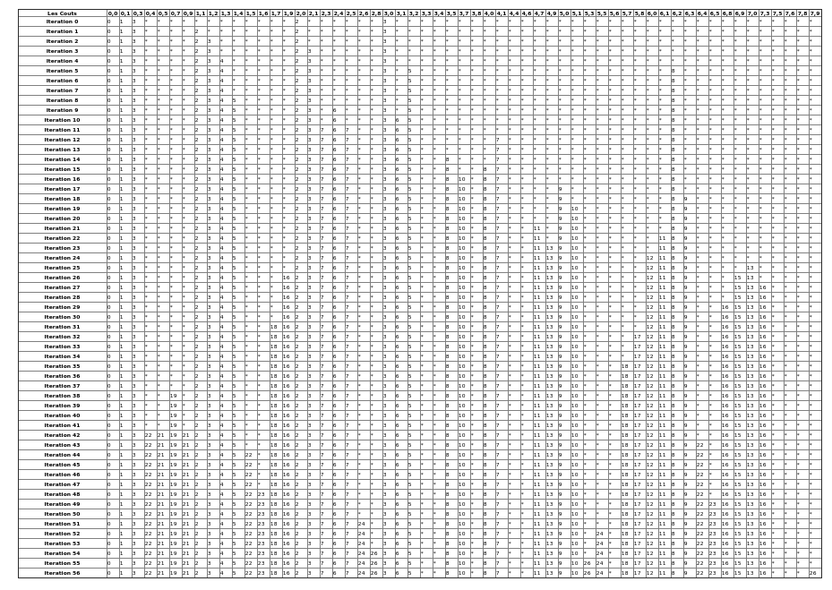

# Dijkstra-s-Path-Finding

Little javascript that dynamically solves mazes of custom sizes.

Features : 
- Length/Width Selection
- Displays the nodes visited for a better visualisation of the algorithm

- Displays the cost table for all iterations

To Do : Have to fix a "splash" bug where areas excluded from the solution path gets colored for bigger mazes.
